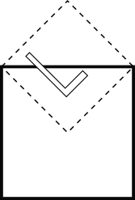

# Un lenguaje que vale más que mil dibujos #

Este lab propone la implementación de un lenguaje pequeño específico
para una tarea muy concreta: combinar dibujos básicos para crear
diseños más interesantes. A este tipo de lenguajes se lo suele conocer
como DSL (Domain Specific Language: lenguaje de dominio específico)
porque están pensados para eso: proveer abstracciones adecuadas para
resolver problemas acotados a cierto ámbito. La idea original del
lenguaje está en este
[artículo](https://cs.famaf.unc.edu.ar/~mpagano/henderson-funcgeo2.pdf "en inglés") 
de Peter Henderson, que recomendamos leer.

Entre las decisiones para elegir está ver si es un DSL embebido en el
lenguaje que usamos para implementarlo (en este caso el DSL será casi
una biblioteca más); cuando el DSL es embebido no necesitamos un
parser sino que aprovechamos el parser del lenguaje host. Cuando
tenemos un EDSL tenemos dos opciones para implementarlo:
deep-embedding o shallow-embedding (profundo/superficial); en el primer
enfoque representamos el DSL con un tipo de datos sobre el cual podemos
realizar cualquier tipo de recorrido. En el shallow-embedding el DSL no
es representado en memoria sino que las valores/funciones del dominio 
son la implementación misma.

Ejemplos de DSL no embebidos son SQL para consultar bases de datos,
Verilog para describir circuitos electrónicos, HTML para describir
páginas web.

Con los EDSL (cualquier variante) ademas de ahorrarnos escribir un
parser tenemos a nuestra disposición todas las conveniencias (o
inconveniencias) del lenguaje host: por ejemplo si estamos en un
lenguaje funcional, podemos aprovecharnos del alto orden,
polimorfismo, etc.

Cuando definimos un lenguaje además de dar su sintaxis tenemos que
explicar qué significan las diferentes construcciones. Podríamos
pensar que el signficado está implícito en el _nombre_ de cada
construcción, pero este camino es corto: pues bien podría suceder que
no entendemos un nombre de una construcción (pongamos un ejemplo
concreto ¿qué puede significar `***` del DSL Arrows de Haskell?).

Cuando definimos un EDSL en un lenguaje funcional la **semántica** (el
significado) queda dado por una función que transforma los programas
del DSL en otras cosas; estas cosas pueden ser elementos de otros
tipos o también efectos como mostrar algo por la pantalla, escribir
algo en un archivo, enviar paquetes por alguna interfaz de red, etc.

## La tarea ##

Implementar un EDSL deeply-embedded para especificar la composición de
dibujos geométricos (un lindo ejercicio del artículo de Henderson es
una figura de Escher) junto con una definición de su semántica usando
una biblioteca de gráficos (por ejemplo Gloss o diagrams).

### El lenguaje  ###

Nuestro lenguaje está parametrizado sobre una colección de figuras
básicas (representado por el no terminal `<Bas>`) y contiene
_instrucciones_ para rotar la imagen 90 grados, para espejarla
horizontalmente, para rotarla 45 grados (reduciendo su tamaño al mismo
tiempo) y para combinar figuras. Apilar pone la primer figura encima
de la segunda, mientras que Juntar las coloca al lado; estas dos
instrucciones toman un par de enteros que indican la proporción
del tamaño de la primera y la segunda figura.

```
 <Fig> ::= Basica <Bas> | Rotar <Fig> | Espejar <Fig> | Rot45 <Fig>
     | Apilar <Int> <Int> <Fig> <Fig> 
	 | Juntar <Int> <Int> <Fig> <Fig> 
	 | Encimar <Fig> <Fig>
```

Usando este lenguaje podemos definir en Haskell funciones que combinan
programas `<Fig>` para producir otros (usualmente esas funciones se
llaman _combinadores_), de algún modo estas funciones dan lugar a
instruccions derivadas (por ejemplo `rotar180 <Fig>` es fácil de
definir como la composición de `Rotar` con `Rotar`).

La semántica formal de las figuras básicas es una función que toma
tres vectores $a,b,c$ en $\mathbb{R}^2$ y produce una figura
bi-dimensional donde $a$ indica el desplazamiento del origen, $b$ el
"ancho" y $c$ el "alto".

### El lab propiamente dicho ###

#### Lenguaje ####

- Definición del lenguaje como un tipo de datos: como no sabemos a
  priori qué figuras básicas tendremos nuestro tipo de figuras debe
  ser polimórfico. 
- Definición de los siguientes combinadores:

  ``` haskell
  -- composición n-veces de una función con sí misma.
  comp :: (a -> a) -> Int -> a -> a
  
  -- rotaciones de múltiplos de 90.
  r180 :: Dibujo a -> Dibujo a
  r270 :: Dibujo a -> Dibujo a

  -- Pone una figura sobre la otra, ambas ocupan el mismo espacio
  (.-.) :: Dibujo a -> Dibujo a -> Dibujo a

  -- Pone una figura al lado de la otra, ambas ocupan el mismo espacio
  (///) :: Dibujo a -> Dibujo a -> Dibujo a

  -- Superpone una figura con otra
  (^^^) :: Dibujo a -> Dibujo a -> Dibujo a

  -- dada una figura la repite en cuatro cuadrantes
  cuarteto :: Dibujo a -> Dibujo a
  
  -- una figura repetida con las cuatro rotaciones, superimpuestas.
  encimar4 :: Dibujo a -> Dibujo a 
  
  -- cuadrado con la misma figura rotada $i$ por $90$ para $i \in \{1..3\}$.
  -- No confundir con encimar4!
  ciclar :: Dibujo a -> Dibujo a
  ```

- Esquemas para la manipulación de figuras.
  ``` haskell
  -- ver un a como una figura
  pureDibe :: a -> Dibujo a
  
  -- map para nuestro lenguaje
  mapDib :: (a -> b) -> Dibujo a -> Dibujo b
  
  -- verificar que las operaciones satisfagan
  -- 1. map pureDibe = id
  -- 2. map (g . f) = mapDib g . mapDib f
  
  -- 
  cambia :: (a -> Dibujo b) -> Dibujo a -> Dibujo b
  
  -- convencerse que se satisface
  -- 1. cambiar pureDibe = id
  -- 2. cambiar f (pureDibe a) = f a
  -- 3. (cambiar g) (cambiar f ma) = cambiar (cambiar g . f) ma

  -- estructura general para la semántica (a no asustarse. Ayuda: 
  -- pensar en foldr y las definiciones 
  sem :: (a -> b) -> b -> (b -> b) -> (b -> b) -> (b -> b) ->
         (Int -> Int -> b -> b -> b) -> 
         (Int -> Int -> b -> b -> b) -> 
		 (b -> b -> b) ->
		 Dibujo a -> b
  ```

  Usando los esquemas anteriores, es decir no se puede hacer
  patter-matching, definir estas funciones:
  ``` haskell
  type Pred a = a -> Bool
  
  -- dado un predicado sobre básicas, cambiar todas las que satisfacen
  -- el predicado por una figura vacía.
  limpia :: Pred a -> Dibujo a -> Dibujo a
  
  -- alguna básica satisface el predicado
  anyDib :: Pred a -> Dibujo a -> Bool
  
  -- todas las básicas satisfacen el predicado
  allDib :: Pred a -> Dibujo a -> Bool
  
  -- describe la figura. Ejemplos: 
  --   desc (Basica b) (const "b") = "b"
  --   desc (Rotar fa) db = "rot (" ++ desc fa db ++ ")"
  -- la descripción de cada constructor son sus tres primeros
  -- símbolos en minúscula.
  desc :: (a -> String) -> Dibujo a -> String

  -- junta todas las figuras básicas de un dibujo
  every :: Dibujo a -> [a]

  -- cuenta la cantidad de veces que aparecen las básicas en una 
  -- figura.
  contar :: Eq a => Dibujo a -> [(a,Int)]
  ```

- Definición de predicados sobre figuras.

  ``` haskell
  -- hay 4 rotaciones seguidas (empezando en el tope)
  esRot360 :: Pred (Dibujo a)
  
  -- hay 2 espejados seguidos (empezando en el tope)
  esFlip2 :: Pred (Dibujo a)
  ```
- Definición de función que aplica un predicado y devuelve 
  un error indicando fallo o una figura si no hay el error.

  ``` haskell
  -- la cadena que se toma como parámetro es la descripción
  -- del error.
  check :: Pred (Dibujo a) -> String -> Dibujo a -> Either String (Dibujo a)
  
  -- aplica todos los chequeos y acumula todos los errores,
  -- sólo devuelve la figura si no hubo ningún error.
  todoBien :: Dibujo a -> Either [String] (Dibujo a)
  ```
- Definir funciones que corrigen los errores detectados:

  ``` haskell
  noRot360 :: Dibujo a -> Dibujo a
  noFlip2  :: Dibujo a -> Dibujo a
  
  -- deben satisfacer 
  -- (1) check esRot360 "foo" (noRot360 f) = Right f', para alguna f'
  -- (2) check esFlip2 "foo" (noFlip2 f) = Right f', para alguna f'
  ```

#### La interpretación geométrica ####

Se debe generar un archivo `Interp.hs` que utilice una biblioteca para
generar gráficos. Se recomienda
[`gloss`](http://hackage.haskell.org/package/gloss) pero se cuenta
como punto extra si se usa otra (ver al final para instalar `gloss`).

  ``` haskell
  -- Suponemos que la biblioteca provee el tipo Vector y Picture.
  type Output a = a -> Vector -> Vector -> Vector -> Picture
  interp :: Output a -> Output (Dibujo a)
  ```

Supongamos que tenemos tres funciones de $p,q,r$ que dados tres
vectores indicando, respectivamente, un desplazamiento al origen $a$, un
ancho $b$ y un alto $c$ producen las siguientes figuras:

|  | figura |
| :--  | :-- |
| $p(a,b,c)=q(a,b,c)$ | {width=50px } |
| $r(a,b,c)$ | {width=50px } |

La semántica de cada operación de nuestro lenguaje está dada por la
siguiente tabla:

| Operacion                | Semántica                                | Visualmente | 
|:-------------------------|:-----------------------------------------|:------------|
| $rotar(p)(a,b,c)$        | $p(a+b,c,-b)$                            | { width=50px }      |
| $rot45(p)(a,b,c)$        | $p(a+(b+c)/2,(b+c)/2,(c-b)/2$            | { width=50px }     |
| $espejar(p)(a,b,c)$      | $p(a + b ,-b,c)$                         | { width=50px }        |
| $encimar(p,r)(a,b,c)$    | $p(a,b,c) ∪ r(a,b,c)$                   | {width=50px }        | 
| $juntar(n,m,p,q)(a,b,c)$ <br> | $p(a,b',c) ∪ p(a + b',r'* b, c)$ con <br> $r' = n/(m+n)$, $r=m/(m+n)$, $b'=r * b$      | { width=75px }   |
| $apilar(p)(a,b,c)$      <br> | $p(a + b',r'* b, c) ∪ p(a ,b, c')$ con <br> $r' = n/(m+n)$, $r=m/(m+n)$, $c'=r' * b$  | { width=75px }   |
                                         | 

Se recomienda fuertemente realizar dibujitos para comprender las
operaciones.

#### Usos ####

La primer tarea es reconstruir el gráfico de Escher (con
triángulos). Para eso se debe crear un directorio `Basico` donde
definen un sínonimo de tipos e implementan los siguientes
combinadores. En función de la siguiente descripción de los dos
primeros niveles:

$lado\ 1\ p\ =\ quartet(blank,blank,rot(p),p)$ <br>
$lado\ 2\ p\ =\ quartet(lado\ 1\ p,lado\ 1\ p,rot(p),p)$

$esquina\ 1\ p\ =\ cuarteto(blank,blank,blank,dibujo\_u\ p)$\ <br>
$esquina\ 2\ p\ =\ cuarteto(esquina\ 1\ p,lado\ 1\ p,rot(lado\ 1\ p),dibujo\_u\ p)$

para esto también necesitan las figuras _u_ y _t_ del paper de
Henderson, que nosotros las generalizamos un poco, en azul se muestra
la figura original.


| figura _t_                                   | figura _u_                                   |
|:--------------------------------------------:|:--------------------------------------------:|
| { width=140px } | { width=140px } |

Ya estamos cerca de completar el proceseo, necesitamos un combinador para nueve piezas:

{ width=140px }

Finalmente podemos definir 

$escher\ n\ p\ =\ noneto(…)$, donde en $P$ va $esquina\ n\ p$ y en $Q$
va $lado\ n\ p$, el resto de las letras deben resolverlas ustedes.

  ``` haskell
  -- supongamos que eligen 
  type Escher = Bool
  
  -- el dibujo u
  dibujo_u :: Dibujo Escher -> Dibujo Escher
  dibujo_u p = undefined 

  -- el dibujo t
  dibujo_t :: Dibujo Escher -> Dibujo Escher
  dibujo_t p = undefined 
  
  -- esquina con nivel de detalle en base a la figura p
  esquina :: Int -> Dibujo Escher -> Dibujo Escher
  esquina n p = undefined
  
  -- lado con nivel de detalle
  lado :: Int -> Dibujo Escher -> Dibujo Escher
  lado n p = undefined

  -- por suerte no tenemos que poner el tipo!
  noneto p q r s t u v w x = undefined
  
  -- el dibujo de Escher:
  escher :: Int -> Escher -> Dibujo Escher
  escher = undefined
  ```

Para verlo, pueden usar la función ```descr``` e interpretar la
descripción!

#### Ver el gráfico ####

Repasemos los tres componentes de nuestro lab: (i) el lenguaje, (ii)
la interpretación geométrica, y (iii) los usos de nuestro lenguaje
(por ahora sólo uno). En ningún caso estamos produciendo ningún
comportamiento, simplemente generamos valores de tipos más o menos
concretos; a algunos los podemos representar como `String`. Es medio
obvio que nos gustaría poder mostrar en la pantalla nuestros dibujos.
Para eso necesitamos lidiar con la entrada/salida.

Como quizás ya saben, la forma en que se estructura la interacción en
Haskell es a través de la _mónada_ de `IO`. No nos preocupemos en qué
es una mónada (para eso pueden hacer el curso de Beta), nos basta con
saber que la librería `gloss` nos ofrece una interfaz cómoda para eso.

Una ventaja de Haskell es la clara separación de responsabilidades:
para resolver un problema en general debemos centrarnos en la solución
_funcional_ del mismo y lo más probable es que no necesitemos IO
(excepto por cuestiones de eficiencia, quizás). Una vez que tenemos
resuelto el problema (en nuestro caso los componentes que mencionamos
más arriba), podemos armar un componente más para la IO.

En nuestro caso, lo que tenemos que realizar es utilizar la función
apropiada de `gloss`:
```haskell
display :: Display -> Color -> Picture -> IO ()
```
hay dos alternativas para el primer argumento una ventana (que podemos
definir con `InWindow "titulo" (width,height) (x0,y0)`) o pantalla
completa (`FullScreen`), el segundo es el color de fondo y el último
argumento es la figura a mostrar. El resultado es una _computación_ en
la mónada de IO. Para ejecutar nuestro programa debemos tener una función
`main`:
```haskell
win = InWindow "Paradigmas" (200,200) (0,0)
main :: IO ()
main = display win white $ circle 100
```

#### Qué debe haber en el repositorio  ####
El contenido mínimo del repositorio debería ser el siguiente:
```
Dibujo.md        # Un readme breve donde comentan su experiencia, indicar
                 # acá si usan otra biblioteca
Dibujo.hs        # Tipo de datos para <Figura> y todas las funciones
                 # relacionadas
Interp.hs        # Interpretación geométrica de las figuras, está bien
                 # si hay figuras que pueden servir para diferentes <Basica>
Basica/Escher.hs # Definición de combinadores, elección de tipo para 
	             # instanciar Dibujo, definción de la interpretación de 
				 # todas las figuras básicas. 
Basica/Extra.hs  # Si se copan y hacen otros diseños, que estén en el
	             # directorio Basica
Main.hs          # Definición del programa, configuración de parámetros.
```

#### Qué se evalúa y puntos extras ####

No se evaluarán proyectos que no se puedan compilar. La idea es que
ningún grupo llegue a este punto al momento de la entrega: pregunten
temprano para evitar esto.

* Que la elección de los tipo de datos sea la adecuada; en
  programación funcional esto es clave.
* Que se comprendan los conceptos de funciones de alto orden y la
  forma en que se combinan funciones.
* Que se pueda adaptar fácilmente a otros usos; en algún momento antes
  de la entrega liberaremos un archivo `Basica/Feo.hs` que use
  `Dibujo.hs` e `Interp.hs` que les permita testear.
* El estilo de programación no se penaliza, pero se recomienda la
  austeridad de todo código funcional elegante.

Se consiguen puntos extras si:

* Identifican abstracciones útiles y relevantes a la hora de definir
  algunas funciones (y usan esas abstracciones).
* Permiten que las figuras básicas especifiquen colores y se muestran
  coloreadas.
* Permiten que se indique por línea de comando qué dibujo mostrar.
* Hacen algo que no se nos ocurrió poner acá pero tiene sentido para
  el lab.
* Extienden el lenguaje para indicar animaciones de figuras.

#### Cómo tener todo listo para hacer el lab ####

Si tenés algún Linux debería ser suficiente con que instales el
paquete de ghc y cabal. Para instalar gloss usamos cabal:
```
$ cabal install gloss
```
Podés comprobar que funcione haciendo:
```
$ ghci
Prelude> import Graphics.Gloss
Prelude Graphics.Gloss> let win = InWindow "Paradigmas" (200,200) (0,0)
Prelude Graphics.Gloss> display win white $ circle 100
```
Si tuviste un fallo al intentar importar `Graphics.Gloss` entonces
pedí ayuda.

Si tenés otro sistema operativo, es probable que o bien vos sepás
mejor que nosotres qué hacer ó que lo más fácil sea bajar e instalar
[Haskell Platform](https://www.haskell.org/platform/).


#### Recursos sobre Haskell ####

* [Learn you a Haskell...](http://learnyouahaskell.com/) 
* [Real World Haskell](http://book.realworldhaskell.org/read/).
* [Buscador de funciones por tipo](https://www.haskell.org/hoogle/)
* [Guía de la sintaxis de Haskell](http://www.cse.chalmers.se/edu/year/2014/course/TDA452/haskell-syntax.html)
* [Documentación de gloss](http://hackage.haskell.org/package/gloss)


### Posibles problemas de instalación

Si al tratar de instalar gloss tiene el siguiente mensaje de error:

    Missing C library: GL

pueden solucionarlo instalando las siguientes librerías de sistema.

    $ sudo apt-get install freeglut3 freeglut3-dev
